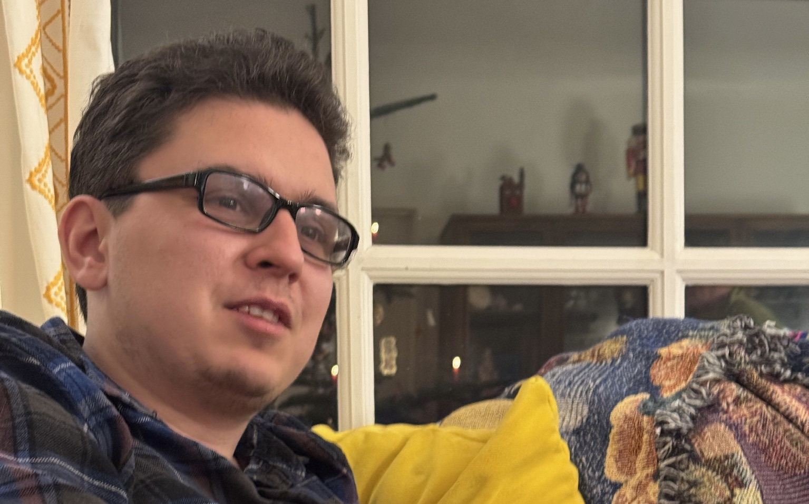

I touched some Python when I was 11, but I never got past making broken text adventures. But when I picked up C++ in college, I realized I just had to keep programming. It's frustrating, rewarding, and magical. I haven't really specialized: I enjoy doing "the whole banana", [as Steve Jobs once put it](https://youtu.be/wvhW8cp15tk?si=4e90tnhFE73BHlq1&t=5016), because I think that's the only way to really understand the end product. I also like [working with others](/projects/#collaborations "sameTab"), though :).

I love to teach. I've TA'd 5 different CS classes for 6 semesters. I've helped with an introductory class in C++; a survey-of-languages class teaching Python, SQL, F#, and Go; and a data structures course, also in C++. I held long review sessions and office hours. Then in Fall 2024, I TA'd a class on embedded programming and hardware. The last class I TA'd was on concurrent programming. The depth of that topic really allowed me to challenge students to get as far as they could on their own while giving them just enough of a push where they were stuck.

More recently, I taught Rust for 12 weeks as part of [my college's Linux User's Group](https://lugatuic.github.io/). There were 14 meetings total. I was mostly teaching from [*Learn Rust with Entirely Too Many Linked Lists*](http://rust-unofficial.github.io/too-many-lists/), which I talk more about [here](/blog/programming-resources/#learn-rust-with-entirely-too-many-linked-lists "sameTab"). It was a wonderfully fun opportunity, and I learned a lot. Most of the meetings were recorded and put [online](https://youtube.com/playlist?list=PLK9aFcPV-ytJI93_ja09k7ie-7pINOXbz&si=bkaFxtqvDLVhh_c9). They aren't very polished, though.

In my free time, I like long bike rides, alternative rock, and Nintendo games. Sometimes I combine them.

