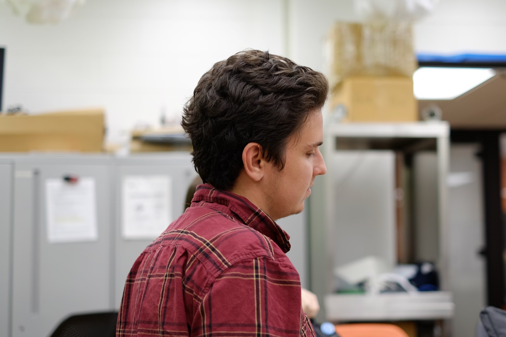

I've been programming seriously for about 6 years, and unseriously for 11. It's frustrating, rewarding, and magical. I haven't really specialized: I enjoy doing "the whole banana", [as Steve Jobs once put it](https://youtu.be/wvhW8cp15tk?si=4e90tnhFE73BHlq1&t=5016), because I think that's the only way to really understand the end product. I also like [working with others](projects#collaborations), though :).

<!--- TODO: Link "working with others" to any projects I've done that have involved working with others. --->

I love to teach. I've TA'd 4 different CS classes for 6 semesters. I've helped with an introductory class in C++; a survey-of-languages class teaching Python, SQL, F#, and Go; and a data structures course, also in C++. I held long review sessions and office hours, and I always tried to get everyone to figure things out for themselves. Last semester, I TA'd a class on embedded programming and hardware. Currently, I'm TA'ing a concurrent programming course that provides great opportunities to learn how to better prompt students to find potential pitfalls.

<!--- For the intro class, I was still figuring out how to teach at all. For the survey class, I had to work with a shifting curriculum and an unhelpful professor; and I also needed to brush up on all those languages (which I only sort-of knew). For data structures, it was a real shift going back to teaching freshmen, and I needed patience - both with the students and with all those lovely [template](https://en.wikipedia.org/wiki/Template_(C%2B%2B)) errors. --->

In my free time, I like long bike rides, alternative rock, and Nintendo games. Sometimes I combine them.

