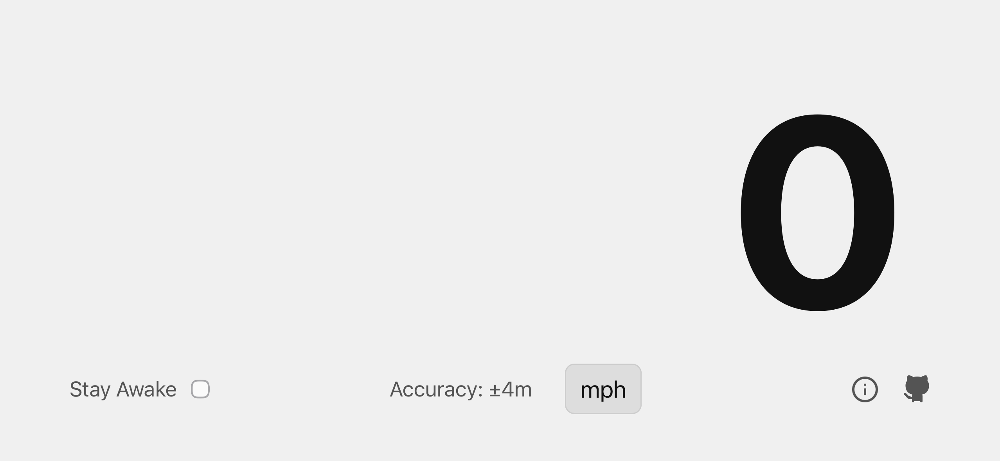

The GitHub icon () next to each title is a link to the repository.
## Path Tracer  {#path-tracer}

[Full Size Image](raytracer-crazy-background.png "newTab")

It's a simple path tracer! I'm following [Ray Tracing in One Weekend](https://raytracing.github.io/books/RayTracingInOneWeekend.html) by Peter Shirley et al., but I'm doing it in Rust for nicer compiler errors.
This is one of my favorite projects. I'm only part-way, but I've also added:
- Lights (the tutorial only has background lighting)
- A command-line interface with [`clap`](https://crates.io/crates/clap)
- A JSON input format for describing the world to be rendered, parsed with [`serde`](https://crates.io/crates/serde)
- A live preview with [`pixels`](https://crates.io/crates/pixels) and [`winit`](https://crates.io/crates/winit)
- Parallelized rendering, using either [`rayon`](https://crates.io/crates/rayon) or [OS threads](https://doc.rust-lang.org/std/thread/). Threads turned out significantly faster!

## Bézier Renderer 

In addition to the above, I wrote a small program that renders béziers (a kind of mathematical curve) to the screen. I was inspired by this wonderful video: [The Beauty of Bézier Curves](https://www.youtube.com/watch?v=aVwxzDHniEw). It's the same structure as the previous project, using mostly the same dependencies - [`clap`](https://crates.io/crates/clap), [`serde`](https://crates.io/crates/serde), [`pixels`](https://crates.io/crates/pixels), and [`winit`](https://crates.io/crates/winit).

## Vibe-coded Speedometer 

This was my main project over my winter 2025-2026 break. It's available at [speedometer.samuel-skean.net](https://speedometer.samuel-skean.net) if you wanna play with it! I almost entirely vibe-coded it - first with Github Copilot, then with ChatGPT and Gemini in my editor, and finally settling on using [Google Jules](https://jules.google.com) for most of it.

I knew a fair amount of the stuff I'd've needed to do it myself before I started, and the vast majority of the time was spent on polish. I may write up my experience more fully later. It was definitely good to get familiar with how it feels to vibe-code, but I really don't want to end up with it as my job. My experience taught me a lot of the same things as [this wonderful arstechnica article](https://arstechnica.com/information-technology/2026/01/10-things-i-learned-from-burning-myself-out-with-ai-coding-agents/), though of course the author of that made several more impressive projects.

# Collaborations {#collaborations}

## Nullability in OO 

My friend [Kevin](https://olympicene.dev) and I wrote a simple interpreter for an Object-Oriented language with a concept of nullability. The idea was to emulate Swift, Dart, or Kotlin with the ability to statically prevent most null pointer errors from being possible by requiring the user to indicate if a field should be nullable. This was mostly my idea, but implementing the interpreter in OCaml was a group effort. It was both trickier and easier than expected.

Right now, there's no frontend, so you'd have to write your programs in the abstract syntax tree. But I might make one someday!
