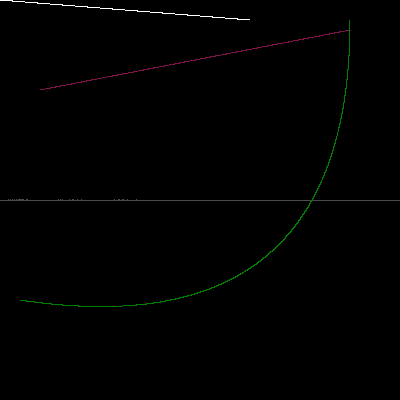

# [Path Tracer](https://github.com/samuel-skean/My_Raytracing_Adventures)

It's a simple path tracer! I'm following [Ray Tracing in One Weekend](https://raytracing.github.io/books/RayTracingInOneWeekend.html) by Peter Shirley et al., but I'm doing it in Rust for nicer compiler errors.
This is one of my favorite projects. I'm only part-way, but I've also added:
- Lights (the tutorial only has background lighting)
- A Command-line Interface with clap
- A JSON input format for describing the world, parsed with serde
- A live preview with SDL2 or pixels and winit

# [Bézier Drawing Program](https://github.com/samuel-skean/SkeanSplinesFun)

In addition to the above, I wrote a small program that renders beziers (a kind of mathematical curve) to the screen. I was inspired by this wonderful video: [The Beauty of Bézier Curves](https://www.youtube.com/watch?v=aVwxzDHniEw). It's the same structure as the previous project, using mostly the same dependencies - clap, serde, pixels, and winit.

# [Nullability in OO](https://github.com/Olympicene/Nullability-in-OO)

My friend [Kevin](https://olympicene.dev) and I wrote a simple interpreter for a Object-Oriented language with a concept of nullability. The idea was to emulate Swift, Dart, or Kotlin with the ability to statically prevent most null pointer errors from being possible by requiring the user to indicate if a field should be nullable. This was mostly my idea, but implementing the interpreter in OCaml was a group effort. It was both trickier and easier than expected.

Right now, there's no frontend, so you'd have to write your programs in the abstract syntax tree. But I might make one someday!